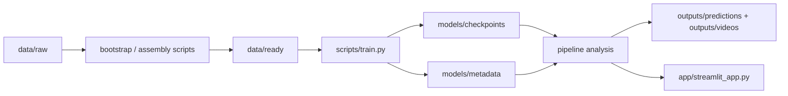

# Murawa Architecture

This document describes the final project layout after the pre-submission refactor. It is the quick map for reviewers and teammates.

## High-level flow



## Configuration

| File | Purpose |
|------|---------|
| [`configs/project.yaml`](../configs/project.yaml) | Project paths, dataset splits, bootstrap params, detection classes, inference defaults |
| [`configs/train.full.yaml`](../configs/train.full.yaml) | Full training profile (epochs, batch, backend sections) |
| [`configs/train.quick.yaml`](../configs/train.quick.yaml) | Quick local/dev training profile |
| [`src/murawa/settings.py`](../src/murawa/settings.py) | Loads `project.yaml` and exposes constants (`PROJECT_ROOT`, `DATA_READY`, …) |

Training scripts read **train profiles only**. Application code and pipeline read **`murawa.settings`**.

## Python package layout

```
src/murawa/
  settings.py              # project-wide constants from project.yaml
  data/                    # raw -> ready dataset pipeline
  models/
    training_common.py     # shared train/valid split loading + YAML parsing
    yolo.py                # YOLO adapter
    rfdetr.py              # RF-DETR adapter (thin entry)
    rfdetr_training.py     # RF-DETR dataset prep + metrics
    rfdetr_inference.py    # RF-DETR prediction helpers
    rfdetr_support.py      # RF-DETR shared constants/helpers
    common.py              # checkpoint config + parsing helpers
  services/
    analysis/
      pipeline.py          # public re-export (analyze_frame*, analyze_match*)
      frame_analysis.py    # single-frame inference flow
      match_analysis.py    # match/video inference flow
      pipeline_helpers.py  # shared payload/builders/progress
      clip_teams.py        # clip-level team stabilization
    rendering/
      overlay.py           # public overlay API
      overlay_draw.py      # bbox/legend drawing
      overlay_video.py     # annotated video writer
    vision/
      tracking.py          # ByteTrack + smoothing
      tracking_ball.py     # primary ball selection
      team_assignment*.py  # per-frame team colors
    runtime/               # artifacts, video I/O, saved analyses
```

### Analysis pipeline

Frame and match analysis are split for readability; import the public API from `murawa.services.analysis.pipeline`:

1. Resolve run and validate input
2. Frame / video extraction
3. Model inference
4. Tracking
5. Team assignment
6. Clip-level team stabilization
7. Render outputs and persist artifacts

Helper logic lives in `pipeline_helpers.py`, `clip_teams.py`, `rendering/overlay*.py`, and `vision/*`.

## Streamlit application

Entry point: [`app/streamlit_app.py`](../app/streamlit_app.py)

| View | File | Backend |
|------|------|---------|
| Analizuj klatkę | `views/frame_page.py` | `analyze_frame_run` |
| Analizuj mecz | `views/match_page.py` | `analyze_match_run` |
| Przeglądaj analizy | `views/analyses_page.py` | `saved_match_analyses` |
| Przegląd danych | `views/data_page.py` | `load_training_split`, `summarize_variant` |
| Analiza modeli | `views/models_page.py` | `load_run_metrics` from training metadata |

Shared UI helpers: [`app/ui_common.py`](../app/ui_common.py) (`render_run_selector`, upload helpers), result rendering: [`app/result_view.py`](../app/result_view.py).

Imports inside `app/` use the `app.*` package prefix (run with `streamlit run app/streamlit_app.py` from repo root).

## CLI scripts

| Script | Role |
|--------|------|
| `scripts/prepare_raw_data.py` | Validate/download raw datasets |
| `scripts/bootstrap_base_variant.py` | Build base/extended variants in `data/ready` |
| `scripts/build_ready_variants.py` | Build transformed ready variants |
| `scripts/train.py` | Train YOLO or RF-DETR, write checkpoints + metadata |
| `scripts/predict.py` | CLI inference for frame/match modes |

## Data directories

Only two dataset stages are used:

- `data/raw/` — downloaded SoccerNet + ball-extra sources
- `data/ready/<variant>/<split>/` — COCO annotations + images for training and test fallback inputs

The legacy `data/selected/` path was removed.

## Training artifacts

Each run stores:

- `models/checkpoints/<run_name>/model.pt`
- `models/metadata/<run_name>/` — config copy, class mapping, train metadata, metrics summary

The **Analiza modeli** Streamlit view reads `metrics_summary.json` (loss history, mAP50) and `train_metadata.json`.

## Development

```bash
pyenv activate ml
pip install -e .
pytest tests/
streamlit run app/streamlit_app.py
```

See also [`context/PROJECT.md`](PROJECT.md) and [`README.md`](../README.md).
